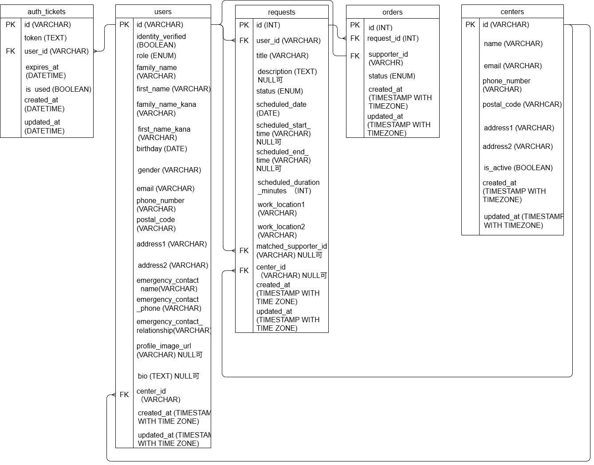
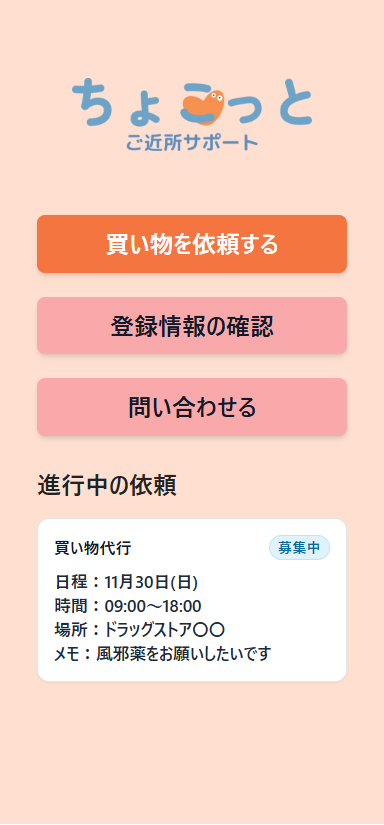
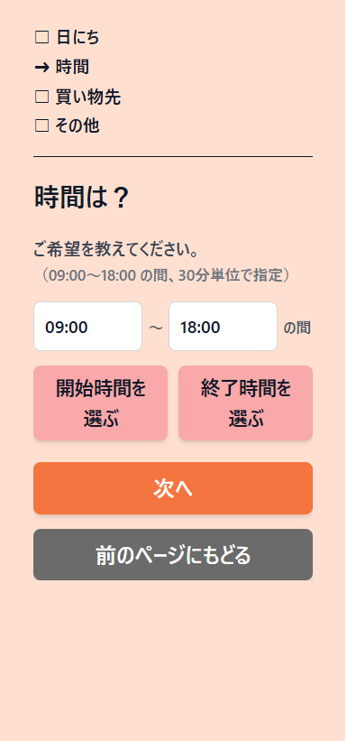
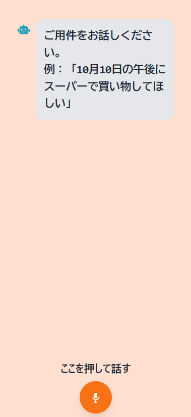
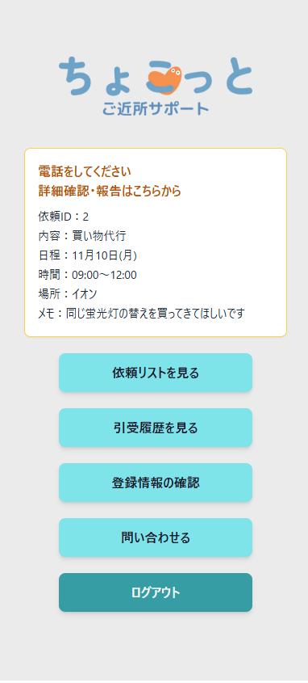
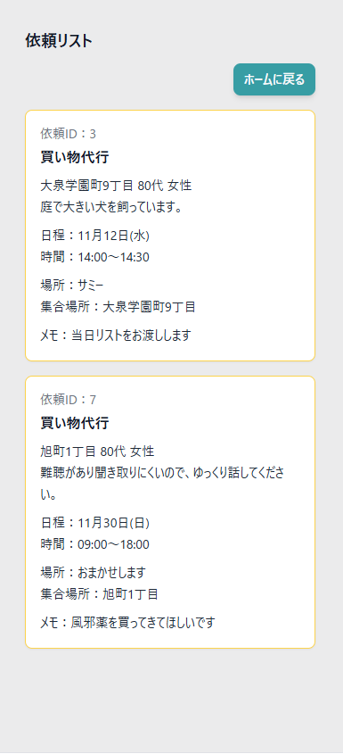

# ご近所サポート　ちょこっと

高齢者×ボランティアのマッチング支援アプリ(卒業制作)

## アプリ概要

高齢者が日常生活でのちょっとした困りごとを気軽に依頼できる “地域支援マッチングアプリ” です。

- 利用者（高齢者）がスマホから簡単に依頼を作成
- サポーター（ボランティア）は依頼一覧を確認し、引き受け可能
- 引き受け後は “マッチング成立” として依頼が進行
- 運営センター（社会福祉協議会などを想定）は利用者の新規登録や全体状況の管理が可能（現時点は非実装）
- 音声入力、大きめのボタン、シンプルなUI など、高齢者に優しいデザイン
- 利用者はQRコードログイン（途中まで対応）。現状は利用者もメール＋パスワードでログイン

## チーム構成（4名）

１）フロントエンド担当（Next.js / UI）  
２）音声入力担当（Web Speech API / OpenAI API）  
３）認証・QRログイン担当（Firebase Authentication）  
４）私：バックエンド担当（API / DB）

## 私の担当範囲

バックエンド（API / DB）を担当し、API 実装・DB設計、依頼〜引受フローの業務ロジック、ロール別APIの整理などを担当しました。

- Express + TypeScript による API 開発
- Prisma / PostgreSQL を用いた DB スキーマ設計
- ロールによって異なる 利用者用 / サポーター用APIの分割実装
- Firebase Authenticationで認証されたユーザー情報をAPI側で扱うための連携
  - Firebase ID Token の検証（verifyIdToken）
  - UIDとDBのUserレコードの紐づけ
  - ロールに基づくアクセス制御（RBAC）
- 依頼の作成 / 取得 / 更新API
- Swagger（OpenAPI）定義とAPIドキュメント整理

## システムアーキテクチャ

Next.js（フロントエンド）  
 ↓ （Firebase Auth）  
Express（TypeScript API）  
 ↓ （Prisma ORM）  
PostgreSQL（データベース）

フロントはFirebase SDKでログイン  
APIはFirebase Admin SDKでID Tokenを検証し、認証済みユーザーとして処理  
PrismaによりDBモデルとAPIの実装を統合  
Docker Composeによって Web / API / DB を一括管理

## DB スキーマ（主要テーブル）

| テーブル   | 役割                                                                                   |
| ---------- | -------------------------------------------------------------------------------------- |
| User       | 利用者 / サポーター。Firebase UIDを保持する設計（現時点ではテスト用UIDをseedして利用） |
| Request    | 依頼内容（依頼種別・日時・場所・メモなど）                                             |
| Order      | サポーターが依頼を引き受けた際に生成されるレコード                                     |
| Center     | 運営センター向けの拡張用テーブル（現時点では未実装）                                   |
| AuthTicket | QRログイン用の一時チケット（認証担当が作成）                                           |

## DB スキーマ（ER 図）

## 認証・認可

### 認証（Authentication）

フロント側でFirebase Authenticationによりログイン  
API側ではFirebase Admin SDKのverifyIdToken() を用いてID Tokenを検証
UIDをもとにDBのUserレコードを取得

### 認可（Authorization）

APIではroleに基づいてアクセス制御を行います。

- user（利用者） → 自分の依頼のみ作成/閲覧/更新
- supporter（サポーター） → 依頼一覧の閲覧 / 引受が可能

ロールによる分岐が増えたため、利用者用APIとサポーター用APIを分割するリファクタリングを実施しました。

## 技術スタック

### バックエンド

- Express.js（TypeScript）
- Prisma / PostgreSQL
- Firebase Admin SDK（認証連携）
- Swagger（OpenAPI 3）
- Zod (入力バリデーション)
- Docker Compose

### フロントエンド

- Next.js（App Router）
- React / React Query
- Tailwind CSS

### その他

- OpenAI API（音声担当が利用）

## ローカル開発（起動方法）

### 依存関係のインストール

pnpm install -r

### 環境変数ファイルの準備

# API 用

cp apps/api/.env.example apps/api/.env

# Docker Compose 用

cp .env.example .env.dev

# Web 用

cp apps/web/.env.example apps/web/.env.local

### Firebase API キー等を記入

apps/api/.env と apps/web/.env.local に Firebase 関連の値を記入します。

### Docker 起動

docker compose up --build

### DB マイグレーション & 初期データ

docker compose exec api pnpm prisma migrate deploy  
docker compose exec api pnpm prisma db seed

## API ドキュメント（Swagger UI）

このプロジェクトのAPI仕様書はOpenAPI形式（YAML）で定義されています。

OpenAPIファイル
apps/api/src/docs/openapi.yaml

### ブラウザで表示（Swagger Editor）

https://editor.swagger.io/?url=https://raw.githubusercontent.com/SoraTakaku-Tokyo/chokotto/main/apps/api/src/docs/openapi.yaml

## 依頼のステータス遷移

依頼は以下の流れで進行します。

open（未引受）  
 ↓ サポーターが引受  
matched（引受済）  
 ↓ 電話確認  
confirmed（対応中）  
 ↓ 作業完了  
completed（完了）

■ 例外的な遷移（キャンセル・辞退・交代・期限切れ）

業務の性質上、例外パターンも複数存在します。

利用者からのキャンセル（canceled）  
サポーターによる辞退 → open に戻る（decline）  
利用者からのサポーター交代要請 → open に戻る（refusal）  
期限切れ（expired）未実装

※ 引き受け後の例外ステータスはOrderテーブルに記録され、依頼テーブルは必要に応じてopen（未引受）へ戻ります。

## 今後改善したい点

- サポーター新規登録APIの実装（現在モック）
- 期限切れ依頼の自動処理（Cron + Worker化）
- 引き受け後に「キャンセル」「辞退」「サポーター交代要請」が発生した場合に、当事者に通知が届く仕組み（トップ画面でわかるように表示）

## 画面イメージ

### 利用者画面

  
  

### サポーター画面

  
  

